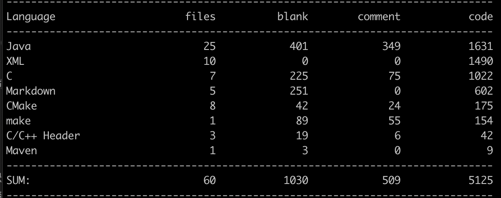

# 网络服务器

该Demo的起源是想利用协程实现一个HTTP服务器，本来是想使用Java语言实现协程的功能，看了几个开源的框架发现并不容易，于是转而把眼光转向C语言的协程实现。由于C语言的提供更多的系统调用，能够方便程序员有更多的机会接触内核的操作。

当然想象始终不及现实，笔者一开始以Java为主程序，利用JNI技术调用[云风](https://github.com/cloudwu/coroutine/)实现的C语言协程库代码，结果当然是一团糟。笔者猜测是C语言切换协程的时候破坏JVM的运行环境，或者是Java的线程受到了影响，导致程序不能顺利进行。

其实完全可以利用C语言实现解析HTTP请求的操作，但是出于笔者的执着，为了能够让C语言实现的协程库调用Java解析HTTP的请求流程，笔者以Java为主程序，调用C的协程库，代码的实现目前相当粗糙，只能说是跑起来了。今后可能的改进想法：将Java解析的HTTP请求的代码嵌入到C语言协程中，系统效率可能会更高，代码会更加优雅。

现在该Demo的内容主要包括几个模块：

- 阻塞IO服务器
- 非阻塞IO服务器（轮询）
- NIO服务器
- 异步IO服务器（尚未实现）
- 协程IO服务器

之后的内容包括：

- 使用五种网络模块进行压力测试
- 完善协程IO服务器
- 完成异步IO服务器

目前代码量：

|Part Ⅰ|Part Ⅱ|Part Ⅲ|Part Ⅳ|
|:---:|:---:|:---:|:---:|
|[基于C语言的协程和Java混合编程](./readme/基于C语言的协程和JNI混合编程的IO服务器.md)|[Linux上使用JNI代码](./readme/在Linux上使用JNI代码.md)|[云风协程库解析](./readme/云风协程库的源码解析.md)|[网络编程](./readme/网络编程.md)|

