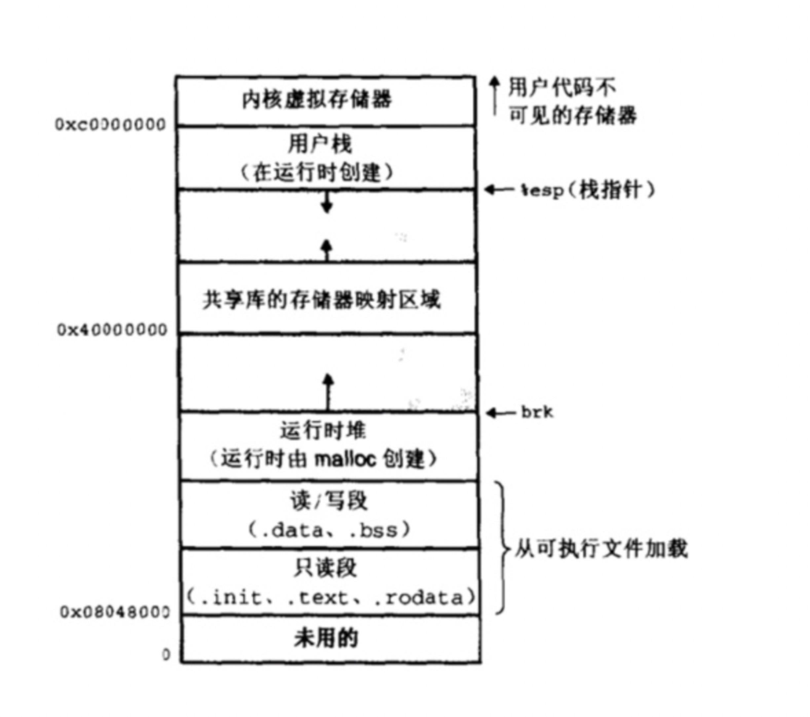
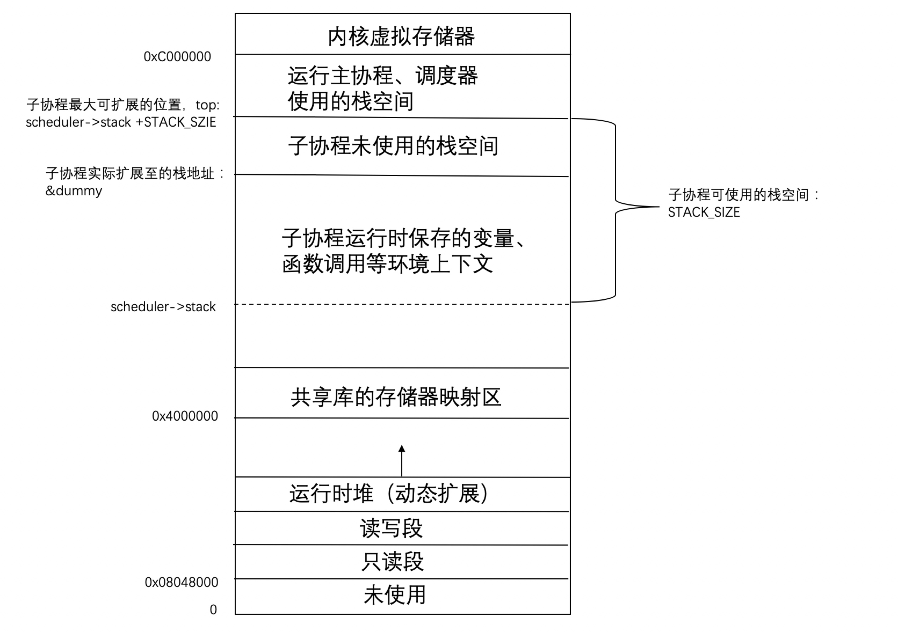

# 云风协程库的源码解析

参考文章：

- [云风协程库保存和恢复协程运行栈原理讲解](https://blog.csdn.net/liushengxi_root/article/details/85114692)
- [基于云风协程库的协程原理解读
](https://blog.csdn.net/liushengxi_root/article/details/85114692)
- [深入理解计算机系统 读书笔记1](https://www.jianshu.com/p/86f9a36ed3dd)


## Linux进程地址空间



在32位操作系统中，进程的最大地址空间为4GB。整个进程地址空间从下往上为地址的增长方向。对于系统中的所有进程来说，代码都是从同一固定地址开始。

- 只读代码和数据：该区域是直接按照可执行目标文件中的内容初始化的，在进程开始运行时，大小就固定不变；

- 堆：运行时随着malloc和free等函数相应地扩大或缩小；

- 共享库：在地址空间约中间的区域存放C标准库等共享库代码；

- 栈：用于函数的调用、局部变量的存放，随着进程的运行动态增长或缩小；

- 内核虚拟区：操作系统的一部分，内核总是驻留在内存中，不允许应用程序读写这个区域的代码。该区域包括内核代码和数据、与进程相关的数据结构（如页表、内核栈等）。


## 协程库的源码分析

云风协程库中的关于程序上下文的操作主要依赖glibc库里"ucontext.h"头文件的几个函数：

```c
getContext()	// 获取当前的context
setContext()	// 切换到指定的context
makeContext()	// 设置函数指针和栈到对应的context保存的sp和pc寄存器
swapContext()	// 保存当前的context 并且换到指定的context
```

### 挂起协程

保存当前子协程的上下文（包括寄存器值和函数调用栈）

 1. &dummy 当前协程的最低栈地址
 2. assert 判断当前协程的运行空间小于等于默认的最大空间(STACK_SIZE)
 3. 如果当前协程的私有栈空间太小不足以保存上下文，需要重新扩容
 4. memcpy 将top-&dummy的地址空间保存到自定义的协程结构中，以便之后恢复环境上下文
 
 子协程的上下文是保存于堆中，因为需要恢复的。

```c
/**
 * @param(coroutine): 当前需要保存上下文的子协程
 * @param(top): 调度器的最高地址（子协程运行于主协程的公共栈空间）
 */
static void _save_stack(struct coroutine *coroutine, char *top) {
    char dummy = 0;
    assert(top - &dummy <= STACK_SIZE);	
    if (coroutine->cap < top - &dummy) {
        free(coroutine->stack);
        coroutine->cap = top-&dummy;
        coroutine->stack = (char *)malloc(coroutine->cap);
    }
    coroutine->size = top - &dummy;
    memcpy(coroutine->stack, &dummy, coroutine->size);
    // memcpy(void *dest, void *src, size_t n);
}
```

通过上面的代码分析，知道是如何保存当前运行的协程上下文之后，挂起协程的操作就一目了然。

```c
/**
 * 1. 根据调度器获取当前的子协程id
 * 2. 保存当前子协程的上下文
 * 3. 运行主协程的代码(scheduler->main_context)
 * 
 * @param(scheduler): 协程调度器（主协程调度协程的结构）
 */
void coroutine_yield(struct scheduler * scheduler) {
    int id = scheduler->running_id;
    assert(id >= 0);
    struct coroutine * coroutine = scheduler->coroutines[id];
    assert((char *)&coroutine > scheduler->stack);
    _save_stack(coroutine,scheduler->stack + STACK_SIZE);
    coroutine->status = COROUTINE_SUSPEND;
    scheduler->running_id = -1;
    swapcontext(&coroutine->context, &scheduler->main_context);
}
```


### 恢复协程

恢复协程的操作，只要把之前保存的协程运行栈空间恢复即可。

 end = shceduler->stack+STACK_SIZE: 运行子协程的高地址
 
 len = coroutine->size: 恢复子协程需要的栈空间
 
 beg = end - len: 运行子协程的低地址，即栈顶地址，开始运行协程的地址
 
 coroutine->stack: 挂起该协程时被保存的环境上下文

```c
/**
 * @param(scheduler): 协程调度器
 * @param(id): 需要被恢复的协程编号
 */
void resume_form_yield(struct scheduler * scheduler, int id) {
	struct coroutine *coroutine = scheduler->coroutines[id];
	
	memcpy(scheduler->stack + STACK_SIZE - coroutine->size, coroutine->stack, coroutine->size);
	scheduler->running_id = id;
	coroutine->status = COROUTINE_RUNNING;
	swapcontext(&scheduler->main_context, &coroutine->context);
}
```

### 启动协程

在了解协程是如何挂起和恢复之后，看下启动一个新的协程是如何操作的：

1. 初始化一个协程环境上下文
2. 记录栈的段地址（ss寄存器）、堆栈寄存器的偏移地址（sp）、子协程context的大小以及协程初次运行时的函数入口
3. 设置该协程的环境上下文并执行。

```c
void start_new_coroutine(struct scheduler * scheduler, int id) {
	struct coroutine *coroutine = scheduler->coroutines[id];
    getcontext(&coroutine->context);
    
    coroutine->context.uc_stack.ss_sp = scheduler->stack;
    coroutine->context.uc_stack.ss_size = STACK_SIZE;
    coroutine->context.uc_link = &scheduler->main_context;
    scheduler->running_id = id;
    coroutine->status = COROUTINE_RUNNING;
    uintptr_t ptr = (uintptr_t)scheduler;
    makecontext(&coroutine->context, (void (*)(void)) main_function, 2, (uint32_t) ptr, (uint32_t) (ptr >> 32));
    swapcontext(&scheduler->main_context, &coroutine->context);
}
```

### 协程的栈地址空间

经过上面的源码分析，可以发现云风的协程库的实现，主要是依赖于对context相关函数的操作：当子协程需要运行时，将自己的环境上下文加入主协程的栈空间；当子协程需要挂起，将自己的环境上下文保存起来。




## 注意事项

1. 协程的大小不能超过设定的STACK_SZIE。除此之外，如果需要超大的栈空间，需要解除系统对栈空间的大小限制。这里在[云风的博客](https://blog.codingnow.com/2012/07/c_coroutine.html)也有提到。

2. 由于每个协程都可能会挂起，保存各自的栈空间，所以在高并发的情况下可能会消耗大量的内存，造成内存不足。


**最后，由于本人才疏学浅，文章如有纰漏，还望各位读者指正。**