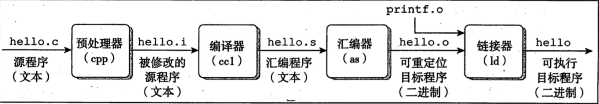

# 在Linux上使用JNI代码


- 生成可执行应用程序
- 链接


参考文章：

- [GCC编译过程与动态链接库和静态链接库](https://www.cnblogs.com/king-lps/p/7757919.html)


## 使用C语言调用Java代码

由于协程Demo的需要，笔者需要使用C语言调用之前写过的Java代码库，从网上搜索到的资料，大多数是关于如何以Java代码为主程序，调用本地C语言接口函数，不符合笔者的需求，所以写下该博客，记录以C语言为运行主程序代码，调用Java相关的代码。


下面代码展示如何在C语言中调用Java代码。

**C代码**

```c
#include <jni.h>
#include <stdio.h>

JNIEnv* jni_init(JavaVM *jvm, char *class_path) {
    JNIEnv *env;
    JavaVMInitArgs vm_args;
    JavaVMOption options[1];

    options[0].optionString = class_path;
    memset(&vm_args, 0, sizeof(vm_args));
    vm_args.version = JNI_VERSION_1_8;
    vm_args.nOptions = 1;
    vm_args.options = options;

    if ((JNI_CreateJavaVM(&jvm, (void**)&env, &vm_args)) == JNI_ERR)  {
        return NULL;
    }

    return env;
}


int main() {
	JavaVM *jvm;
    JNIEnv *env;
    jclass clazz;
    jmethodID method_id;

    env   = jni_init(jvm, "-Djava.class.path=/root/demo/classes");
    clazz  = load_class(env, "edu/xmu/networkingModel/coroutineIOComponent/CoroutineIOServer");
    if (clazz == 0) {
        printf("error: call method failed.\n");
        return NULL;
    }
    method_id = (*env)->GetStaticMethodID(env, clazz, "testMethod", "()I");
    if (method_id == 0) {
        printf("error: call method failed.\n");
    }
    
    jint res = (*env)->CallStaticIntMethod(env, clazz, method_id);
    printf("get from java: %d\n", res);
}
```

**Java代码**

```java
package edu.xmu.networkingModel.coroutineIOComponent;

public class CoroutineIOServer {
   public static int testMethod() {
        return 111;
    }
}
```


## 在Linux上生成可执行文件


关于JNI的一些详细语言，笔者这里就不再赘述。主要记录在Linux上使用C语言，调用Java项目工程相关的代码的解决方案。


首先查看笔者的项目目录如下，在demo文件夹中，存放着java相关的代码和c文件。	

```
demo
├── coroutine.c
├── coroutine.h
├── demo4.c
├── edu
│   └── xmu
│       ├── baseConponent
│       │   ├── http
│       │   │   ├── HttpContext.java
│       │   │   ├── HttpRequest.java
│       │   │   ├── HttpResponse.java
│       │   │   ├── Request.java
│       │   │   └── Response.java
│       │   ├── MethodType.java
│       │   ├── RequestMessage.java
│       │   ├── RequestParseUtil.java
│       │   ├── RequestState.java
│       │   ├── ResponseParseUtil.java
│       │   └── ResponseState.java
│       ├── HttpServerConsole.java
│       └── networkingModel
│           ├── AbstractWorkRunnable.java
│           ├── asynchronousIOComponent
│           │   ├── AcceptCompletionHandler.java
│           │   ├── AsynchronousIOServer.java
│           │   ├── ReadCompletionHandler.java
│           │   └── WriteCompletionHandler.java
│           ├── blockingIOComponent
│           │   ├── BlockingIOServer.java
│           │   └── BlockingWorkRunnable.java
│           ├── coroutineIOComponent
│           │   └── CoroutineIOServer.java
│           ├── multiplexingIOComponent
│           │   ├── MultiplexingIOServer.java
│           │   ├── MultiplexingReadRunnable.java
│           │   └── MultiplexingWriteRunnable.java
│           └── nonblockingIOComponent
│               ├── NonBlockingIOServer.java
│               └── NonBlockingWorkRunnable.java
├── javaClassList.txt
├── main.c
├── server.c
├── server.h
├── start
├── tool.c
└── tool.h
```


为了生成可执行的应用程序，做了如下的工作：

**1. 将项目中的Java类名写入文件**
	
```
$ find . -name "*.java" > javaClassList.txt

效果如下：
./edu/xmu/HttpServerConsole.java
./edu/xmu/baseConponent/RequestMessage.java
...
```

**2. 打包编译Java类至指定位置**

```
$ javac -d /root/demo/classes @javaClassList.txt
```

**3. 链接**

```
gcc -o start coroutine.c tool.c server.c main.c -I/root/downloads/jdk1.8.0_201/include -I/root/downloads/jdk1.8.0_201/include/linux -L/root/downloads/jdk1.8.0_201/jre/lib/amd64/server -ljvm
```

熟悉makefile语言的同学，可以将编译链接过程写入makefile文件中。


（注：笔者使用的是64位的Ubuntu系统，不同的操作系统可能会导致以上的指令失效）

## 链接

记得之前在看《深入理解计算机系统》时，接触过Linux链接的相关知识，当时理对链接的理解也不深，这次有机会在实际项目中遇到，正好再次复习。

### 编译

在Unix系统中，从源文件到目标文件的转化是由编译器驱动程序完成的：

```
unix> gcc -o hello hello.c
```

在这里，GCC编译器驱动程序读取源程序文件hello.c，并把它翻译成一个可执行目标文件hello。这个翻译过程可以分为四个阶段完成，如下图。这行这四个阶段的程序（预处理器、编译器、汇编器和链接器）一起构成了编译系统。



### 静态库和动态库

Linux的库文件分为动态链接库（通常以.so结尾）和静态链接库（通常以.a结尾），两者的差别尽在程序执行时所需的代码实在运行时动态加载的，还是在编译时就已经静态加载完毕。


#### 静态库

静态链接：在链接阶段将汇编生成的目标文件(.o)与引用的库一起链接打包到可执行文件中

静态库的特点：

- 静态库对函数的链接是放在编译时期完成的
- 浪费大量的空间
- 静态库一旦被修改，所有连接该静态库的程序都要重新编译

创建静态库：

Linux静态库的命名格式：以lib为前缀，中间library_name为苦命，扩展名为.a，例如"libmylibrary.a"

```
创建静态库示例：
1. 首先将代码文件编译为目标文件(staticFile.o)，
	参数"-c"抑制直接编译为可执行文件
2. 通过ar工具将目标文件打包为静态库文件(libstaticfile.a)

$ gcc -c staticFile.c	
$ ar -crv libstaticfile.a staticFile.o
```

静态库的使用：

默认情况下，GCC在链接时优先使用动态链接库，只有当动态链接库不存在时才考虑使用静态链接库。为了强制使用静态链接库，需要在编译的时候加上参数"-static"。例如在/home/lib下有libfoo库，为了使用静态链接，输入命令如下：

```
// libfoo 在链接时，使用"-lfoo"
$ gcc foo.c -L/home/lib -static -lfoo -o foo
```

#### 动态库

动态库在程序编译时并不会被链接到目标代码中，而是在程序运行时才被载入。不同的程序如果调用相同的库，那么在内存中只需要一份该共享库的实例。由于动态库在程序运行时才被载入，解决了静态库对调用程序更新带来的麻烦，用户只需更新被修改的库文件代码。


动态库的特点：

- 动态库在内存中只存在一份拷贝，避免了静态库的空间浪费问题
- 动态库对库函数的链接载入推迟到程序运行期间，速度低于静态库
- 可以实现进程之间的资源共享（因此动态库也称共享库）
- 程序升级变得简单

### gcc链接库文件的使用

从程序员的角度看，函数库实际上就是头文件(.h)和库文件(.so或者.a)的集合。虽然Linux下的大多数函数都默认将头文件放到/usr/inculde/目下以及将库文件放在/usr/lib/目录下，但在需要第三方库函数库的时候，gcc在编译时必须要有自己的办法来查找所需的头文件和库文件。


gcc采用搜索目录的办法来查找所需的文件：

- -I选项可以向gcc的头文件搜索路径中添加新的目录
- -L选项可以向gcc的库文件搜索路径中添加新的目录