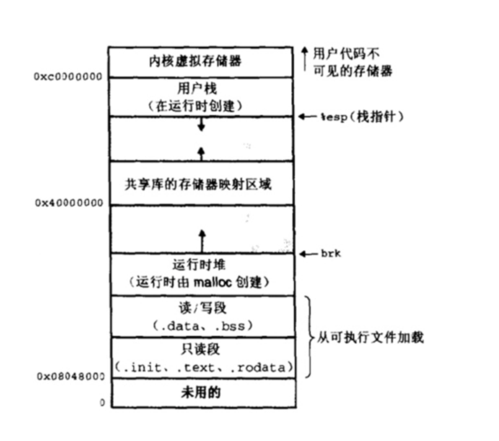

# 学习云风协程库

文章参考：

- [云风协程库保存和恢复协程运行栈原理讲解](https://blog.csdn.net/liushengxi_root/article/details/85114692)
- [基于云风协程库的协程原理解读
](https://blog.csdn.net/liushengxi_root/article/details/85114692)

## Linux进程地址空间

在32位操作系统中，进程的最大地址空间为4GB。整个进程地址空间从下往上为地址的增长方向。