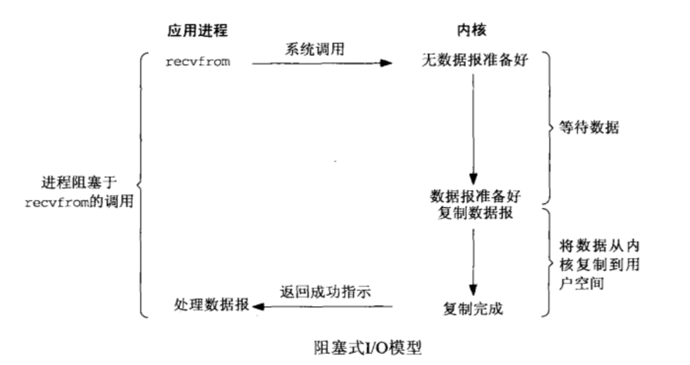
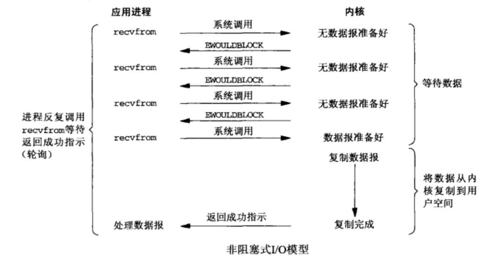
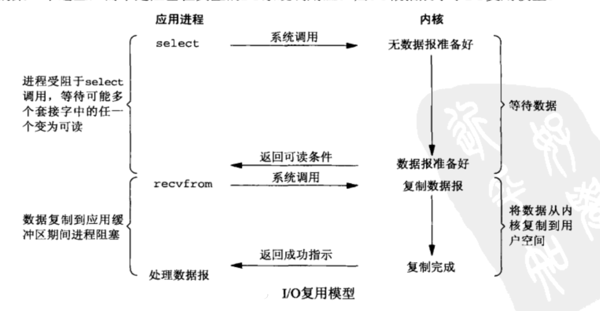
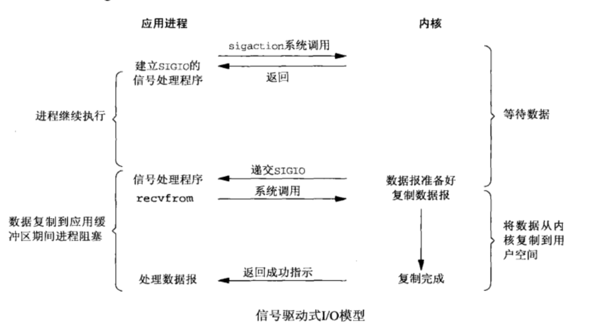
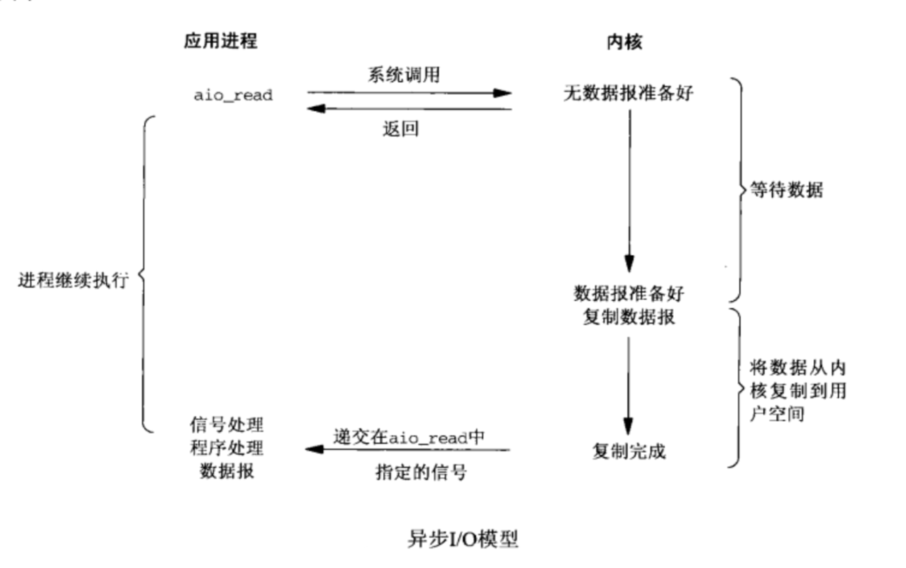

# 网络编程


学网络编程之前，最好先弄清两个基础的概念，阻塞与非阻塞、同步与异步之间的区别究竟在哪里，这是让很多初学者混淆的知识点。下面通过《Unix网络》的IO模型来理解这些概念。

## IO模型



阻塞IO模型的优缺点非常明显：优点即编程简单，缺点是所有的连接都等待数据的到来，造成CPU空载。



同样地，非阻塞IO模型的优缺点也很明显：相对于阻塞IO模型，优点是解决了阻塞于等待数据的到来，而造成的缺点是每次都需要忙轮询所有的连接，造成CPU忙轮询。



IO多路复用模型解决了忙轮询的缺点，不用CPU主动轮询所有的连接，而是内核通知用户真正需要轮询处理的IO事件，但是会阻塞于调用函数select或者epoll，优缺点见select和epoll函数。



信号驱动IO模型为非阻塞的同步IO模型，与上面三个函数不同的是，CPU不必忙轮询或者阻塞于epoll函数，而是在数据准备好之后，通过信号通知CPU处理数据。



该异步IO模型属于非阻塞的异步IO模型，与上面四个函数不同的是，内核在数据到来时，应用层不需要等待从内核复制数据到用户空间，而是使用回调函数处理事件。

### 阻塞/非阻塞和同步/异步

一个IO操作可以分为两个操作：

1. 读时等待数据准备好（或写时等待有数据的到来）
2. 读时从内核向用户进程复制数据（或写时从用户进程向内核写入数据）

根据步骤一：判断一个I/O是否为阻塞以CPU是否阻塞于等待数据的到来，比如上面的阻塞I/O模型、IO多路复用模型为阻塞IO，而非阻塞I/O模型、信号驱动I/O模型和异步IO模型均为非阻塞I/O模型

根据步骤二：判断一个I/O是否为异步以CPU是否等待于内核与用户进程空间的数据交换。CPU在异步I/O模型中，可以在数据进行交换的同时干其他的事情（宏观的角度）。

另外值得一提的，只有同步具有阻塞和非阻塞的区别，异步一定是非阻塞的。

## select、poll和epoll函数

IO多路复用的三个函数的具体实现

### select 函数

select函数允许进程指示内核等待多个事件中的任何一个发生，并只在有一个或多个事件发生或经历一段指定事件后才唤醒它。

select感兴趣的描述符不局限于套接字，任何描述符都可以使用select测试

```
int select(int maxfdp1, 
			fd_set *readset, 
			fd_set *writeset, 
			fd_set *exceptset, 
			const struct timeval *timeout);

return:
	- 如有就绪描述符则为其数目;
	- 若超时则为0;
	- 若出错则为-1.
timeout:
	- 永远等待下去：仅在只有一个描述符准备好I/O时才返回;
	- 等待一段固定事件;
	- 根本不等待：检查描述符后立即返回，即轮询.
readset: 
writeset: 
exceptset: 
	让内核测试读、写和异常条件的描述符
	void FD_ZERO(fd_set *fdset);	// 清零感兴趣集中所有的文件描述符fd
	void FD_SET(int fd, fd_set *fdset);	// 在感兴趣集中将fd设置为待测试
	void FD_CLR(int fd, fd_set *fdset);	// 关闭fd在感兴趣集中的设置
	int FD_ISSET(int fd, fd_set *fdset);	// fd是否在感兴趣集中被打开
maxfdp1: 
	指定待测试的描述符个数，它的值是待测试的最大描述符加1（maxfd+1）,
	描述符0,1,2,...,一直到maxfdp1-1均被测试.

```

**select的最大描述符**

操作系统通常对每个进程可用的最大描述符设置了上限（操作系统对系统可打开的描述符也做了上限），select就是用相同的限制值。然而当今的Unix版本允许每个进程使用事实上无限的描述符（往往受限于内存总量和管理的限制）。

以笔者的Ubuntu主机为例，默认进程可打开的文件描述符为65535。

```
$ ulimit -n
65535
```

在4.4BSD操作系统的中，有如下代码：

```c
// "sys/types.h"头文件
#ifndef FD_SETSIZE
#define FD_SETSIZE 256
#endif
```

为了能够改变select可使用的最大描述符，可以模仿上面的代码，对内核的FD_SETSIZE定义为上限使用，然后重新编译内核（不重新编译内核而仅仅改变其值是不够的）。

### poll 函数

**poll没有最大文件描述符数量的限制**

poll的实现和select相似，只是文件描述符集合的方式不同，poll一个结构链表处理描述符的状态，而select使用的描述符的数组，所以可打开的数目有有限。

### epoll 函数

select和poll函数效率低下的原因在于：

epoll函数的出现解决了select和poll存在的几个问题：

- 没有文件描述符数量的限制（除了受限于单个进程的内存总量和管理的限制）；
- 使用非轮询的方式提高效率，epoll并不会由于打开的文件描述的增加而降低效率，只需要被注册并有事件通知的文件描述符会被处理；
- 使用存储映射I/O（mmap函数），减少数据拷贝。


```
int epoll_create(int size);
return:
	创建成功返回epoll打开的文件描述符，失败返回-1
size:
	通知内核该epoll_fd监听的描述符有多大，值为maxfd+1
	Linux 2.6.8之后，参数被忽略
和普通文件描述符一样，epoll使用完需要关闭，否则会造成fd耗尽的情况
	
int epoll_ctl(int epollfd, int op, int fd,struct epoll_event *event);
return: 
	注册事件函数，成功返回0，失败返回-1
op:
	- EPOLL_CTL_ADD 注册
	- EPOLL_CTL_MOD 修改
	- EPOLL_CTL_DEL 删除
fd:
	注册的文件描述符
events:
	注册需要监听的事件

int epoll_wait(int epollfd, struct epoll_event *events, int maxevents, int timeout);
return:
	返回触发注册事件的数量
epollfd:
	epoll文件描述符
events:
	指向注册事件被触发的结构
maxevents:
	maxevents不能超过epoll_create的size
	maxevents通知内核等待事件发生的events大小
	笔者的想法：
	既然Linux 2.6.8之后size被忽略，该参数就不必大于size了
	但是maxevents不能大于events，否则会有事件被忽略
timeout(ms):
	- 0 ，表示不等待
	- -1，永久阻塞，另一种说法是将不确定

typedef union epoll_data {
	void *ptr;
	int fd;
	__unit32_t u32;
	__unit64_t u64;
}epoll_data_t;

struct epoll_event {
	epoll_data data;
	__unit32_t events;	// 可被监听的事件
	/**
		- EPOLLIN : fd有数据可读（包括socket正常的关闭）
		- EPOLLOUT: fd有数据可写
		- EPOLLPRI: fd有带外数据
		- EPOLLERR: fd发生错误
		- EPOLLHUP: fd被挂断（比如epoll监听一个尚未连接的套接字）
		- EPOLLET : epoll_fd设置为边缘触发模式
		- EPOLLLT : epoll_fd设置为水平触发模式
		- EPOLLONESHOT: fd只被监听一次（如果需要继续监听，请重新加入epoll队列）
	 */
}
```

epoll函数有EPOLLLT和EPOLLET两种触发模式，在Java NIO的底层实现(Linux 2.6之后的版本)只有水平触发模式。

**边缘触发模式**

ET模式是“高速”工作方式，只支持非阻塞IO操作。在边缘触发模式中，内核通知相应的文件描述符准备就绪的次数只有一次。该模式工作下的epoll文件描述符，

ET模式存在的问题：

1. 需要使用while循环读取内核缓冲区，一般是读到EAGAIN(EWOULDBLOCK)，也可以读到小于应用层缓冲区大小。如果内核缓冲区非空，而应用层缓冲区已满来不及读取，读事件不会被再次触发。
2. 需要使用while循环写到内核缓冲区，一般是写到EAGAIN(EWOULDBLOCK)，也可以写到小于应用层缓冲区大小。如果内核缓冲区非满，而应用层缓冲区为空来不及写入，写事件不会被再次触发。

解决ET模式经常触发读写事件的方法：应用层需要自行解决内核不再通知可读写的问题。

**水平触发模式**

LT模式是默认的工作方式，支持阻塞和非阻塞IO操作。在水平触发模式中，只要文件描述符准备就绪（有数据可写/可读），内核就会不断唤醒epoll_wait。

LT模式存在的问题：

1. 读事件：如果内核读缓冲区非空，无法及时读取内核的数据，读事件就会被一直触发；
2. 写事件：如果内核写缓冲区非满，无法及时写入数据至内核，写事件就会被一直触发。

解决LT模式经常触发读写事件的方法：修改fd的注册事件（比如注销事件），或者把fd移除epoll_fd。

（注：当对一个非阻塞流的读写发生缓冲区满或缓冲区空，write/read会返回-1，并设置errno=EAGAIN。而epoll只关心缓冲区非满和缓冲区非空事件）。


**注意写事件：**

1. 对于ET模式，应用层向TCP缓冲区写入，有可能是应用层数据写完了，但是TCP缓冲区没有写到EAGIAIN事件，那么此时需要在应用层做个标记，表明TCP缓冲区是可写的，否则由于ET只触发一次，应用层就再也不会被通知缓冲区可写了；

2. 对于LT模式，如果应用层没有数据需要向TCP缓冲区写入，epoll会不停通知可写，为了避免多次无效的唤醒，需要将fd移除epoll队列或者关闭注册事件。


### 关于epoll的一道面试题

使用Linux epoll模式的水平触发模式，当socket可写，是会不停地触发socket可写的事件，如何处理？

笔者在使用Java编写NIO服务器demo时就遇过相同的问题，因为处理accept和处理读事件在不同的线程，如果读事件没有处理掉不停触发socket写事件，就会造成该socket被超过一个线程读取数据。笔者当时的处理是：在将任务分配给处理读事件的线程前，先关闭该socket的读注册事件，再将任务交给线程处理，之后再注册可写事件。至于socket是否继续注册读事件，由具体业务进行处理。


在[牧童的博客](http://blog.sina.com.cn/s/blog_77d329940102x8ex.html)的博客里提出了两种解决方案：

1. 第一种是比较普通的方案，在需要向fd写数据的时候才把fd注册到epoll。这个方案和笔者的方案是一致的，缺点是需要将fd加入和移除epoll都会有一定的代价；
2. 另一种比较高效也简单的方案，不注册fd的写事件，在读取数据并且处理之后，直接将response写回对应的fd。但是需要注意处理写缓冲区满的情况，可以在此时将fd注册写事件，在epoll的驱动下等待缓冲区可写，最后将fd移除epoll队列。


## 参考博客

- [aspirant](https://www.cnblogs.com/aspirant/p/9166944.html)
- [鱼思故渊](https://blog.csdn.net/yusiguyuan/article/details/15027821)
- [牧童的博客](http://blog.sina.com.cn/s/blog_77d329940102x8ex.html)
